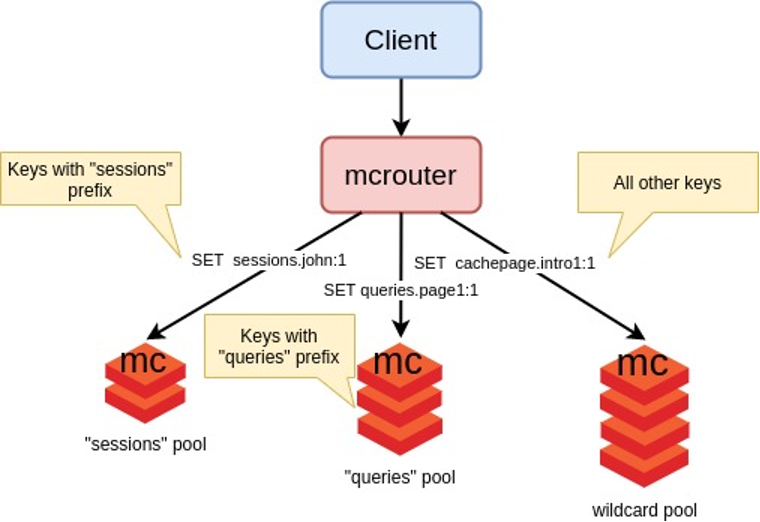

### Memcached operator

---
Operator create pool memcached instances, while one.
1. Memcache and mсrouter instances are created, 
as well as their services to connect your application. Mcrouter acts as a balancer.

---
For install clone this repo and go to folder memcached-operator,
and run kubectl apply -f manifests

